<div class="cover" style="page-break-after:always;font-family:方正公文仿宋;width:100%;height:100%;border:none;margin: 0 auto;text-align:center;">
    <div style="width:60%;margin: 0 auto;height:0;padding-bottom:10%;">
        </br>
        
    </div>
    </br></br></br></br></br>
    <div style="width:60%;margin: 0 auto;height:0;padding-bottom:40%;">
        
	</div>
    </br></br></br></br></br></br></br></br>
    <span style="font-family:华文黑体Bold;text-align:center;font-size:20pt;margin: 10pt auto;line-height:30pt;">《基于Verilog与Sword开发板的贪吃蛇游戏设计》</span>
    <p style="text-align:center;font-size:14pt;margin: 0 auto">实验报告 </p>
    </br>
    </br>
    <table style="border:none;text-align:center;width:72%;font-family:仿宋;font-size:14px; margin: 0 auto;">
    <tbody style="font-family:方正公文仿宋;font-size:12pt;">
    	<tr style="font-weight:normal;"> 
    		<td style="width:20%;text-align:right;">上课时间</td>
    		<td style="width:2%">：</td> 
    		<td style="width:40%;font-weight:normal;border-bottom: 1px solid;text-align:center;font-family:华文仿宋"> 23秋冬周二3,4,5节，周二9,10节</td>     </tr>
    	<tr style="font-weight:normal;"> 
    		<td style="width:20%;text-align:right;">授课教师</td>
    		<td style="width:2%">：</td> 
    		<td style="width:40%;font-weight:normal;border-bottom: 1px solid;text-align:center;font-family:华文仿宋">王跃明、洪奇军 </td>     </tr>
    	<tr style="font-weight:normal;"> 
    		<td style="width:20%;text-align:right;">姓　　名</td>
    		<td style="width:2%">：</td> 
    		<td style="width:40%;font-weight:normal;border-bottom: 1px solid;text-align:center;font-family:华文仿宋"> 孙兆江、胡育玮、兰欣豫</td>     </tr>
		<tr style="font-weight:normal;"> 
    		<td style="width:20%;text-align:right;">专　　业</td>
    		<td style="width:2%">：</td> 
    		<td style="width:40%;font-weight:normal;border-bottom: 1px solid;text-align:center;font-family:华文仿宋"> 计算机科学与技术</td>     </tr>
    	<tr style="font-weight:normal;"> 
    		<td style="width:20%;text-align:right;">组　　别</td>
    		<td style="width:%">：</td> 
    		<td style="width:40%;font-weight:normal;border-bottom: 1px solid;text-align:center;font-family:华文仿宋"> 16</td>     </tr>
    	<tr style="font-weight:normal;"> 
    		<td style="width:20%;text-align:right;">日　　期</td>
    		<td style="width:2%">：</td> 
    		<td style="width:40%;font-weight:normal;border-bottom: 1px solid;text-align:center;font-family:华文仿宋">2024.1.4</td>     </tr>
    </tbody>              
    </table>
</div>

## 摘要


## 绪论

### 设计背景

基于Verilog的贪吃蛇游戏设计是一种硬件描述语言（HDL）的应用，旨在将贪吃蛇游戏实现在可编程逻辑器件（本实验使用SWORD板）上。贪吃蛇游戏作为一个经典而风靡全球的小游戏，我们在原有游戏规则的基础上增加了速度调节等功能设计。

除此之外，本次实验使用了键盘输入，VGA显示等使游戏易于游玩。设计一个基于Verilog的贪吃蛇游戏是一项有趣而具有挑战性的工程任务。

### 主要内容

在设计基于Verilog的贪吃蛇游戏实验时，首要任务是将系统划分为模块，包括蛇的控制、食物生成、游戏逻辑、输入处理和显示控制。通过Verilog代码实现游戏状态机，定义开始、运行和结束等状态，并确保状态之间的正确切换。编写模块来控制蛇的移动、长度增加、碰撞检测以及食物的生成。处理输入信号，如按钮或开关，将其转换为游戏控制命令。设计Verilog代码以控制显示设备，渲染游戏画面。确保整个系统在正确的时序下运行，通过仿真工具进行调试。最终，将Verilog代码加载到实际硬件平台上进行测试，以确保游戏在硬件上正常运行。整个实验设计过程涵盖了数字电路设计、硬件描述语言编写、仿真调试和实际硬件测试的多个关键步骤。

### 难点

1. **输入设备：** 确定如何接收玩家输入。如何使用外部设备（例如按钮、开关、键盘）或通过其他方式实现物理输入以及如何使用Verilog模块处理和解释这些输入是本次设计的难点。
2. **显示设备：** 显示设备决定游戏的可视化表示。本实验中使用VGA驱动显示，如何激发显示信号以及如何将图片通过IP核中的ROM模块显示是难点之一。
3. **调试和仿真：** 在设计过程中，使用Verilog的仿真工具进行调试是至关重要的。这有助于在实际硬件上加载代码之前发现和纠正潜在的错误。在物理实验板上发现错误后及时纠正也是具有挑战性的地方之一。

### 软件及硬件使用

软件：此设计基于`Vivado 2023.1`版本开发

硬件：基于浙江大学硬件实验SWORD板开发，其FPGA基于`Xilinx Kintex-7`嵌入式核心板

## 贪吃蛇游戏设计原理

### 总体模块设计

本实验模块主要分为逻辑部分与设备交互部分。

逻辑部分的核心是有限状态机，此外有蛇的控制、食物生成等逻辑模块，其中每一模块在具体实现上又会分为多个module。

-  **游戏控制模块：**
   - 游戏状态机：定义游戏的开始、运行和结束等状态，管理状态之间的转换。
   - 游戏计时器：用于控制游戏速度，确定蛇的移动速度。
-  **蛇控制模块：**
   - 蛇状态存储：保存蛇的当前位置、长度和方向等信息。
   - 蛇移动逻辑：根据用户输入和计时器触发，更新蛇的位置。
   - 碰撞检测：检测蛇是否与边界或食物发生碰撞。
-  **食物生成模块：**
   - 食物位置生成：随机生成新的食物位置。
   - 食物状态存储：保存当前食物的位置信息。

设备交互部分主要由七段数码管显示、VGA显示与键盘读入一集时钟与时序控制模块组成。

* **键盘输入模块**
  - 键盘输入负责处理输入信号，并输出方向
* **VGA与七段数码管显示输出模块**
  - VGA负责显示图片与像素信息
  - 七段数码管负责显示分数
* **时钟与时序设计模块**
  - 主时钟分频外还需要提供VGA/PS2使用的特殊时钟
  - 确定状态机更新时间

### 状态机设计

我们通过Verilog代码实现了一个有限状态机，用于控制贪吃蛇游戏的状态。该状态机包括三个主要状态：游戏初始化 (`INITIAL`)、游戏运行 (`RUNNING`) 和游戏结束 (`DIE`)。在初始化状态下，一旦检测到用户的方向输入信号，状态将切换到运行状态。在运行状态下，如果蛇碰到边界或碰到自身，游戏状态将切换到结束状态，并在两秒后返回初始化状态。该有限状态机通过时钟上升沿触发。

### Input/Output

我们的主要I/O设计有：

1. 开关输入：速度模式选择、重置状态、运行时暂停
2. 键盘输入：方向选择
3. VGA输出：图像信息
4. 七段数码管输出：分数信息

#### 键盘输入（PS2）

PS/2 接口(Personal System/2)是一种 PC 电脑上的接口，可用来连接键盘和鼠标。接口共有 6 个接脚，除接地与 Vcc 外，有**时钟和一位数据**（另外两脚为保留未使用）。Sword 板内有 USB-PS2 转换，因此我们可以将 USB 键盘或鼠标插入板上 USB 口来使用。

PS/2 协议中，一次传输有效数据为**一字节**，每次传输（一帧）为 **11 位**，分别为开始位（1 位，一直为 `0`）、有效数据（8 位）、校验位（1 位）、结束位（1 位，一直为 `1`），在我们简单的设计里，每一帧数据中只需要关注中间的 8 位有效数据即可。

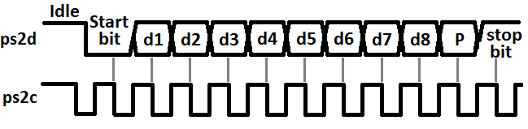

PS/2 将键盘编码分为通码(Make)与断码(Break)，通码代表“按下”，断码代表“松开”。键盘上大部分按键的通码只有一字节（比如 WASD 等字母按键），但也有特殊按键的通码为两字节（比如上下左右，其格式为 `E0` 开头的两字节数据）。断码是在通码的基础上添加一字节的 `F0` 数据，比如 `W` 的通码为 `1D` 断码为 `F0 1D`，上 `↑` 的通码为 `E0 75` 断码为 `E0 F0 75`。由此我们可知，通码可能需要 1~2 帧，断码可能需要 2~3 帧（如果传输内容超过 1 帧，键盘可以保证传输内容是连续的，不会被其他信号隔开）。PS/2 键盘可以实现全键无冲突，因为按键按下后如果不松开，则至少不会发送断码，我们可以认为在得到一个按键断码之前，这个按键一直是被按下的状态。

本实验由于只使用四个方向键，PS2接口结构较为简单，如下所示

```verilog
module PS2(
    input clk, rst,
    input ps2_clk, ps2_data,
    output reg up, left, right, enter
);
```

具体实现参考了github中的部分[代码](https://github.com/PAN-Ziyue/FPGA--JOJO/blob/master/JOJO/Framework/PS2.v)

#### VGA显示输出

VGA(Video Graphics Array) 协议是一种使用模拟信号的显示标准，我们需要提供的是数字信号（如比较重要的 RGB 三色值、扫描同步信号等），板内 DAC(Digital-to-Analog Converter, DAC/D2C) 会将其转换为 VGA 接口需要的模拟信号。

影响画面质量的因素较主要的有分辨率、刷新率以及色彩。**分辨率**指屏幕中显示的有效像素点数量，一般以 `aaa × bbb` 表示，前者指一行中像素点个数，后者指一列中像素点个数。**刷新率**指屏幕内容刷新速度，一般以 Hz 为单位表示一秒钟刷新多少次。**色彩**主要指色彩空间格式与“精度”，VGA 要求使用 RGB 色彩空间（即红绿蓝三色混合）且为 12 位，即一个色彩通道用 4 位表示。在我们的实验中，使用 640×480@60Hz 的显示模式，需要接入的时钟频率为 25.175MHz。

我们使用**逐行扫描**的方式来打印界面，即每次图片刷新都从左上角开始，先从左到右扫描完一行，再转到下一行的最左边开始扫描，直到扫描完最后一行。我们需要处理**行时序**与**场时序**，时序图如下:

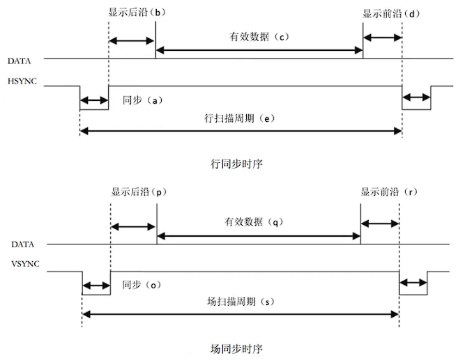

对于 640×480@60Hz 的显示模式，上图中行扫描的 `a, b, c, d, e` 分别为 `96, 48, 640, 16, 800`，场扫描的 `o, p, q, r, s` 分别为 `2, 33, 480, 10, 525`。下面以行时序为例进行解释：行同步阶段(96)将行同步信号置于**低位**进行同步；显示后沿(48)将行同步信号重新拉起到**高位**但并不显示图像（将 RGB 三色通道均置为 0 即可）；有效数据(640)为每行 640 个像素点，此时将像素点对应的色彩 RGB 值放置在相应通道上进行色彩输出；显示前沿(16)不显示图像；之后将进入下一个周期的行扫描（从行同步开始）此时已经开始对下一行进行扫描，一次扫描经过的像素点数量(800)，但实际打印的有效数据数量(640)。场同步扫描与行同步扫描相似。

实验中使用的VGA驱动模块代码接口：

```verilog
module vgac(
    input vga_clk, // 对于640*480@60Hz，由原理可知应接入 25MHz 时钟
    input clrn, // 重置信号，低电平有效，有效时将扫描信号归位到 (0, 0)
    input [11:0] d_in, // 12 位 RGB 信号，格式为 bbbb_gggg_rrrr，每个色彩通道使用 4 位
    output reg [8:0] row_addr, // 扫描地址
    output reg [9:0] col_addr, 
    output reg rdn, // 判断当前扫描到的地址是否为有效数据，低电平为有效
    output reg [3:0] r,g,b, // 三个色彩通道值，直接连接到顶层模块输出即可
    output reg hs, vs // 行同步信号与场同步信号，详见原理
);
```

#### IP核——ROM使用

ROM是FPGA中的可读写内存，在Vivado中，我们可以将数据以`.coe`文件的形式预先存入ROM中，便于显示调用图片信息。

首先我们通过`IP Catalog`创建IP核资源，方法为进入`IP Catalog`界面，搜索`Block Memory Generator`

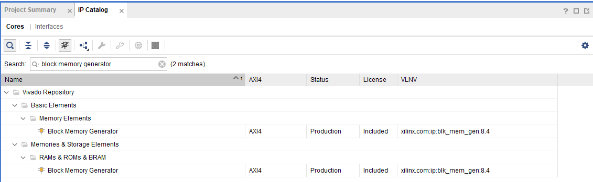

双击进入创建界面，首先设定Basic面板。

* Component Name：设置该IP核的名称。
* Interface Type：`RAM`接口总线。这里保持默认选择Native接口类型（标准RAM接口总线）。
* Memory Type：存储器类型。可配置成Single Port RAM（单端口RAM）、Simple Dual Port RAM（伪双端口RAM）、True Dual Port RAM（真双端口RAM）、Single Port ROM（单端口ROM）和Dual Port ROM（双端口ROM），这里选择Simple Dual Port RAM。
* ECC Options：Error Correction Capability，纠错能力选项，这里保持默认。
* Write Enable：字节写使能选项，勾中后可以单独将数据的某个字节写入RAM中，这里不使能。
* Algorithm Options：算法选项。可选择Minimum Area（最小面积）、Low Power（低功耗）和Fixed Primitives（固定的原语），这里选择默认的Minimum Area。

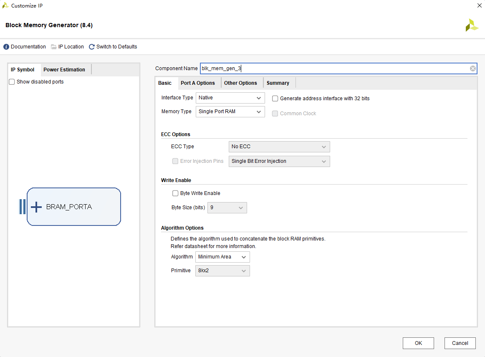

接下来选择`Port A Options`

* `Write/Read Width`：表示每一个数据的位宽，比如这里我想要加载12位的rgb数据，即设定为12。
* `Write/Read Depth`： 表示数据量，比如一张640*480的图片就有307200的数据量。

设定合适的数据量可以最大化储存空间。

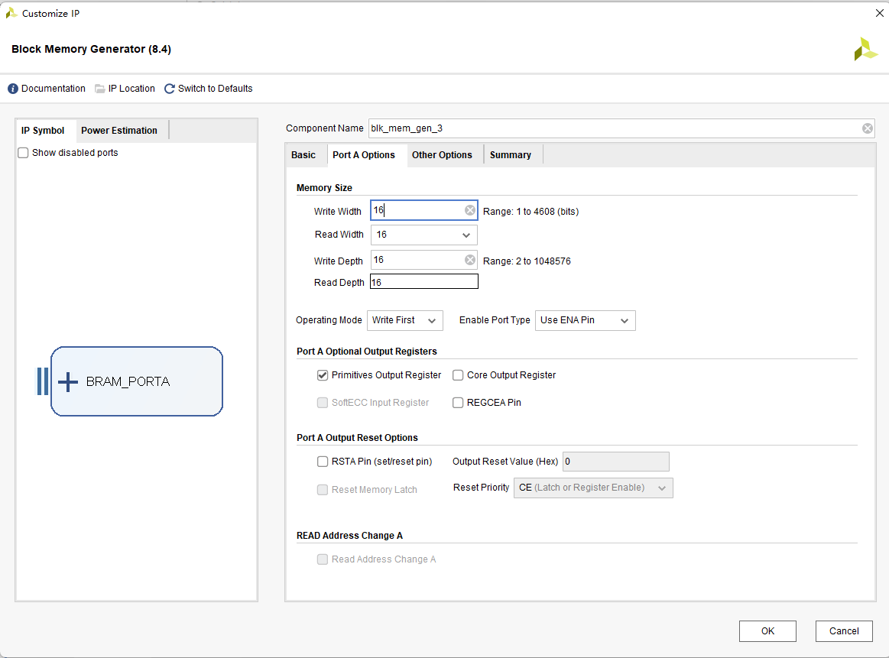

在`Other Options`选择需要加载的`.coe`文件即可，若数据量大于RAM大小，则会报错（如图）

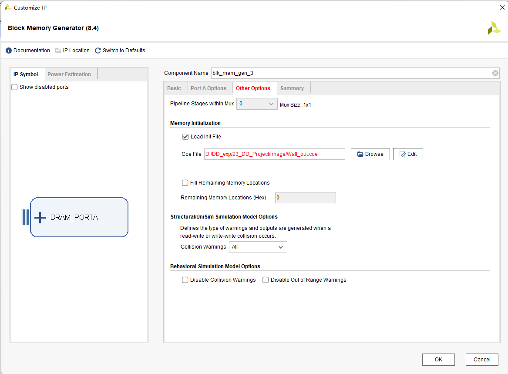

之后点击完成生成即可。

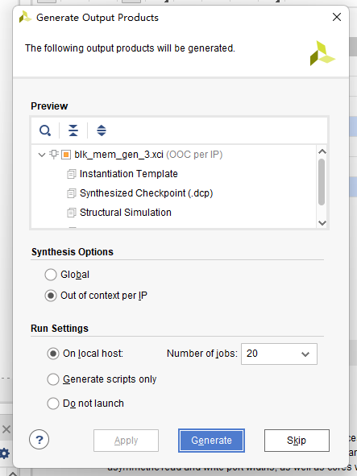

生成结束后，会生成一系列示例文件、数据文件、仿真文件等，可以在`IP Sources`中查看

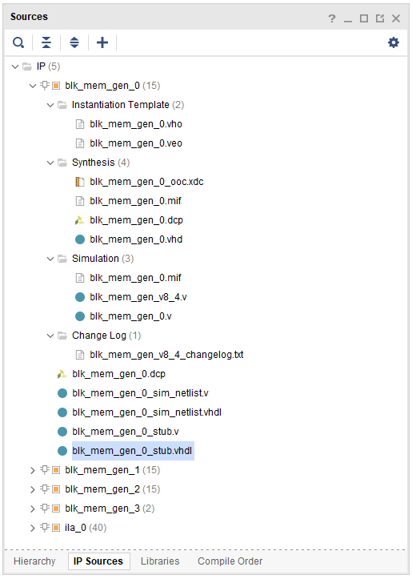

#### 七段数码管输出

七段数码管输出参考本学期实验课代码，本实验中使用`bin2bcd.v`将 2 进制转化为 10 进制 BCD 码。

## 代码模块详述

### 代码结构

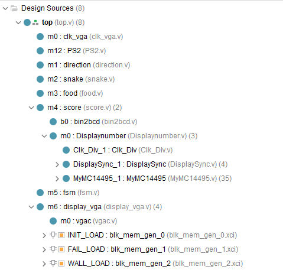

### 顶层代码

**整体设计：**

`top.v`实现了一个贪吃蛇游戏的顶层模块。该模块整合了VGA显示、PS2键盘输入、游戏逻辑、状态机、蛇的运动控制、食物生成和计分等多个子模块，最终通过VGA接口呈现出贪吃蛇游戏的画面。该模块还支持暂停、减速等功能，并通过状态机管理游戏的状态转换，包括游戏运行、死亡和初始化等不同阶段。

**Star：**

* 使用`localparam`进行类似于C语言中`#define`的操作使代码可读性提高。

**代码：**

```verilog
`timescale 1ns / 1ps
module top (
    input clk,
    input rst,
    input pause,  // pause button
    input slow,  // slow button
    input ps2_clk,
    input ps2_data,
    output [3:0] AN,  // 数码管使能
    output [7:0] SEG,  // 数码管输出
    output [11:0] vga,  // VGA输出
    output h_sync,
    output v_sync,  // VGA扫描信号
    output btnx4
);
    /* 
    扫描信号800*525 有效长度640*480
    目前使用640*480进行制作
    坐标大小为32*24 每一个坐标对应20*20的方块
    蛇的长度 max 64
    横坐标10位寄存器，纵坐标9位寄存器
    */
    reg [31:0]clkdiv;
	always@(posedge clk) begin
		clkdiv <= clkdiv + 1'b1;
	end

    wire clk_vga;  // VGA模块的时钟信号
    wire [1:0] game_state;  // 游戏状态
    wire [1:0] next_direction;  // 下一个方向
    wire [1:0] current_direction;  // 当前方向

    wire hit_boundary;  // 撞墙flag
    wire hit_self;  // 撞自己flag

    // define states and directions
    localparam RUNNING = 2'b00;  // 运行状态
    localparam DIE = 2'b01;  // 死亡状态
    localparam INITIAL = 2'b10;  // 初始状态

    localparam UP = 2'b00;
    localparam DOWN = 2'b01;
    localparam RIGHT = 2'b10;
    localparam LEFT = 2'b11;

    wire get_food;  // 获取食物
    wire food_display;  // 食物显示
    wire [4:0] food_x;  // 食物的横坐标
    wire [4:0] food_y;  // 食物的纵坐标

    wire [5:0] snake_length_display;  // 蛇的长度
    wire [319:0] snake_x_1dim;  // 蛇的横坐标
    wire [319:0] snake_y_1dim;  // 蛇的纵坐标

    wire up_pb; // up 消抖信号
    wire down_pb; // down 消抖信号
    wire right_pb; // right 消抖信号
    wire left_pb; // left 消抖信号

    clk_vga m0 (
        .clk(clk),
        .clk_vga(clk_vga)
    );  // 生成VGA时钟分频 50MHz -> 25MHz

    PS2 m12 (
        .clk(clk),
        .rst(rst),
        .ps2_clk(ps2_clk),
        .ps2_data(ps2_data),
        .up(up_pb),
        .down(down_pb),
        .right(right_pb),
        .left(left_pb)
    );  // PS2键盘

    direction m1 (
        .clk(clk),
        .up(up_pb),
        .down(down_pb),
        .right(right_pb),
        .left(left_pb),
        .direction(next_direction)
    );  // 方向控制

    snake m2 (
        .clk(clk),
        .pause(pause),
        .slow(slow),
        .next_direction(next_direction),
        .game_state(game_state),
        .food_x(food_x),
        .food_y(food_y),
        .current_direction(current_direction),
        .snake_x_1dim(snake_x_1dim),
        .snake_y_1dim(snake_y_1dim),
        .snake_length_display(snake_length_display),
        .hit_boundary(hit_boundary),
        .hit_self(hit_self),
        .get_food(get_food),
        .food_display(food_display)
    );  //  蛇的运动方向控制 死亡检测

    food m3 (
        .clk(clk),
        .get_food(get_food),
        .game_state(game_state),
        .food_x(food_x),
        .food_y(food_y)
    );  //  食物的生成

    score m4 (
        .clk(clk),
        .rst(rst),
        .game_state(game_state),
        .get_food(get_food),
        .AN(AN),
        .SEG(SEG)
    );  //  计分

    fsm m5 (
        .clk(clk),
        .rst(rst),
        .up(up_pb),
        .down(down_pb),
        .right(right_pb),
        .left(left_pb),
        .hit_boundary(hit_boundary),
        .hit_self(hit_self),
        .game_state(game_state)
    );  //  状态机

    display_vga m6 (
        .clk(clk_vga),
        .food_x(food_x),
        .food_y(food_y),
        .snake_x_1dim(snake_x_1dim),
        .snake_y_1dim(snake_y_1dim),
        .snake_length(snake_length_display),
        .game_state(game_state),
        .food_display(food_display),
        .r(vga[11:8]),
        .g(vga[7:4]),
        .b(vga[3:0]),
        .h_sync(h_sync),
        .v_sync(v_sync)
    );  // VGA显示
endmodule
```

### 交互模块代码

#### `m0 clk_vga`

**整体设计：**由50Mhz的主时钟生成一个适合VGA模块的25Mhz时钟

**代码：**

```verilog
`timescale 1ns / 1ps

module clk_vga (
    input clk,
    output reg clk_vga
);
    reg [2:0] cnt;

    initial begin
        cnt = 32'b0;
    end

    wire [2:0] cnt_next;
    assign cnt_next = cnt + 1'b1;

    always @(posedge clk) begin
        if (cnt < 1) begin
            cnt <= cnt_next;
        end else begin
            cnt <= 0;
            clk_vga <= ~clk_vga;
        end
    end

endmodule
```

#### `m12 PS2`

**整体设计：**键盘信号处理代码，主要通过通断码识别键盘输入，输出为四个按键的二进制数值，1表示按着，0表示松开。

**Star：**

* `ps2_clk` 的频率较低，数量级在 `kHz` 水平，而我们 FPGA 的时钟是较快的，在实现时可以对时钟进行打拍记录来确定“下降沿”的位置

  ```verilog
  reg ps2_clk_falg0, ps2_clk_falg1, ps2_clk_falg2;
  always@(posedge clk or posedge rst)begin
      if(rst)begin
          ps2_clk_falg0<=1'b0;
          ps2_clk_falg1<=1'b0;
          ps2_clk_falg2<=1'b0;
      end
      else begin
          ps2_clk_falg0<=ps2_clk;
          ps2_clk_falg1<=ps2_clk_falg0;
          ps2_clk_falg2<=ps2_clk_falg1;
      end
  end
  
  wire negedge_ps2_clk = !ps2_clk_falg1 & ps2_clk_falg2;
  reg negedge_ps2_clk_shift;
  
  always@(posedge clk)begin
      negedge_ps2_clk_shift<=negedge_ps2_clk;
  end
  ```

**代码：**

```verilog
module PS2(
	input clk, rst,
	input ps2_clk, ps2_data,
	output reg up, left, right, down
	);

reg ps2_clk_falg0, ps2_clk_falg1, ps2_clk_falg2;
wire negedge_ps2_clk = !ps2_clk_falg1 & ps2_clk_falg2;
reg negedge_ps2_clk_shift;
reg [9:0] data;
reg data_break, data_done, data_expand;
reg[7:0]temp_data;
reg[3:0]num;

always@(posedge clk or posedge rst)begin
	if(rst)begin
		ps2_clk_falg0<=1'b0;
		ps2_clk_falg1<=1'b0;
		ps2_clk_falg2<=1'b0;
	end
	else begin
		ps2_clk_falg0<=ps2_clk;
		ps2_clk_falg1<=ps2_clk_falg0;
		ps2_clk_falg2<=ps2_clk_falg1;
	end
end

always@(posedge clk or posedge rst)begin
	if(rst)
		num<=4'd0;
	else if (num==4'd11)
		num<=4'd0;
	else if (negedge_ps2_clk)
		num<=num+1'b1;
end

always@(posedge clk)begin
	negedge_ps2_clk_shift<=negedge_ps2_clk;
end


always@(posedge clk or posedge rst)begin
	if(rst)
		temp_data<=8'd0;
	else if (negedge_ps2_clk_shift)begin
		case(num)
			4'd2 : temp_data[0]<=ps2_data;
			4'd3 : temp_data[1]<=ps2_data;
			4'd4 : temp_data[2]<=ps2_data;
			4'd5 : temp_data[3]<=ps2_data;
			4'd6 : temp_data[4]<=ps2_data;
			4'd7 : temp_data[5]<=ps2_data;
			4'd8 : temp_data[6]<=ps2_data;
			4'd9 : temp_data[7]<=ps2_data;
			default: temp_data<=temp_data;
		endcase
	end
	else temp_data<=temp_data;
end

always@(posedge clk or posedge rst)begin
	if(rst)begin
		data_break<=1'b0;
		data<=10'd0;
		data_done<=1'b0;
		data_expand<=1'b0;
	end
	else if(num==4'd11)begin
		if(temp_data==8'hE0)begin
			data_expand<=1'b1;
		end
		else if(temp_data==8'hF0)begin
			data_break<=1'b1;
		end
		else begin
			data<={data_expand,data_break,temp_data};
			data_done<=1'b1;
			data_expand<=1'b0;
			data_break<=1'b0;
		end
	end
	else begin
		data<=data;
		data_done<=1'b0;
		data_expand<=data_expand;
		data_break<=data_break;
	end
end

always @(posedge clk) begin
	case (data)
        10'h272:down <= 1;
        10'h372:down <= 0;
        10'h275:up <= 1;
        10'h375:up <= 0;
        10'h26B:left <= 1;
        10'h36B:left <= 0;
        10'h274:right <= 1;
        10'h374:right <= 0;
    endcase
end

endmodule
```

#### `m4 score`

**整体设计：**通过识别`get_food`信号的改变来计算分数并且显示。

**代码：**

```verilog
`timescale 1ns / 1ps
module score (
    input clk,
    input [1:0] game_state,
    input get_food,
    input rst,
    output [3:0] AN,
    output [7:0] SEG

);

    reg [15:0] score = 0;
    wire [15:0] bcd;

    always @(negedge get_food) begin
        if(game_state == 2'b00) score <= score + 1;
        else score <= 0;
    end

    bin2bcd b0 (
        .bin(score[7:0]),
        .bcd(bcd[9:0])
    );

    Displaynumber m0 (
        .clk(clk),
        .hexs(bcd), // 4'b0000
        .LEs(4'b0000),
        .points(4'b0000),
        .rst(1'b0),
        .AN(AN),
        .SEGMENT(SEG)
    );
endmodule

```

##### 子模块`bin2bcd`

该子模块的作用是将2进制转换成10进制bcd码表示，便于以十进制方式显示。

其思路为：首先，先将BCD码计数器清零，之后将二进制数和BCD码计数器统统左移，二进制数移出来的最高位放到BCD码计数器的最低位。每一次移位之后都判断下，BCD码计数器的十、分以及个位是否大于4，如果任何一位（4bit）大于4，则对其加3，之后继续移位，如此下去，直到移位次数为二进制数的位数之后，停止移位，此时得到的BCD码计数值便是转换后的值。

**代码**：

```verilog
module bin2bcd
 #( parameter                W = 8)  // input width
  ( input      [W-1      :0] bin   ,  // binary
    output reg [W+(W-4)/3:0] bcd   ); // bcd {...,thousands,hundreds,tens,ones}

    integer i,j;

    always @(bin) begin
    for(i = 0; i <= W+(W-4)/3; i = i+1) bcd[i] = 0;     // initialize with zeros
    bcd[W-1:0] = bin;                                   // initialize with input vector
    for(i = 0; i <= W-4; i = i+1)                       // iterate on structure depth
      for(j = 0; j <= i/3; j = j+1)                     // iterate on structure width
        if (bcd[W-i+4*j -: 4] > 4)                      // if > 4
          bcd[W-i+4*j -: 4] = bcd[W-i+4*j -: 4] + 4'd3; // add 3
    end

endmodule
```

#### `m6 display_vga`

**整体设计：**

`display_vga`主要由`vgac`模块、ip核及取地址代码构成。其核心思路在于确定`vgac`返回的`x_addr`和`y_addr`所对应的像素数据。因此，该模块也需要通过游戏状态来确定显示内容。

**Star**：

* 在Verilog中，二维数组是无法直接在模块间传递的，所以需要通过二维数组转一维数组后再通过`module`传递。

  实现关键代码：

  ```verilog
  integer i;
  always @(snake_x_1dim,snake_y_1dim)
      begin
          for (i=0;i<64;i=i+1)
              begin
                  snake_x_reg[i]<=snake_x_1dim[5*i+:5];
                  snake_y_reg[i]<=snake_y_1dim[5*i+:5];
              end
      end
  // 生成二维数组
  
  genvar i;
  generate
      for (i = 0; i < 64; i = i + 1) begin
          assign snake_x_1dim[i*5+:5] = snake_x[i];
          assign snake_y_1dim[i*5+:5] = snake_y[i];
      end
  endgenerate
  //生成一维数组
  ```

**代码：**

```verilog
`timescale 1ns / 1ps
module display_vga (
    input clk,
    input [4:0] food_x,
    input [4:0] food_y,
    input [319:0] snake_x_1dim,
    input [319:0] snake_y_1dim,
    input [5:0] snake_length,
    input [1:0] game_state,
    input food_display,
    output [3:0] r,
    output [3:0] g,
    output [3:0] b,
    output h_sync,
    output v_sync
);

    wire rdn;
    wire [9:0] x_addr;
    wire [8:0] y_addr;

    // define states and directions
    localparam RUNNING = 2'b00;  // 运行状态
    localparam DIE = 2'b01;  // 死亡状态
    localparam INITIAL = 2'b10;  // 初始状态

    localparam UP = 2'b00;
    localparam DOWN = 2'b01;
    localparam RIGHT = 2'b10;
    localparam LEFT = 2'b11;

    localparam NONE = 2'b00;
    localparam APPLE = 2'b01;
    localparam SNAKE = 2'b10;
    localparam WALL = 2'b11;

    localparam NONE_COLOR = 12'h000;
    localparam APPLE_COLOR = 12'hfff;
    localparam SNAKE_COLOR = 12'hff0;

    reg [3:0] snake_r;
    reg [3:0] snake_g;
    reg [3:0] snake_b;
    reg [11:0] snake_color;

    reg [4:0] snake_x_reg[63:0];
    reg [4:0] snake_y_reg[63:0];

    // 生成二维数组
    integer i;
	always @(snake_x_1dim,snake_y_1dim)
	begin
	for (i=0;i<64;i=i+1)
		begin
			snake_x_reg[i]<=snake_x_1dim[5*i+:5];
			snake_y_reg[i]<=snake_y_1dim[5*i+:5];
		end
	end

    reg [11:0] vga_in;
    reg clrn;

    vgac m0 (
        .vga_clk(clk),
        .clrn(clrn),
        .d_in(vga_in),
        .col_addr(x_addr),
        .row_addr(y_addr),
        .rdn(rdn),
        .r(r),
        .g(g),
        .b(b),
        .hs(h_sync),
        .vs(v_sync)
    );

    reg [1:0] pixel_flag;

    wire [18:0] address;
    wire [11:0] data_ini;
    wire [11:0] data_fail;

    wire [8:0] address_wall;
    wire [11:0] data_wall;

    assign address = x_addr + y_addr * 640;
    assign address_wall = (x_addr % 20) + (y_addr % 20) * 20;

    blk_mem_gen_0 INIT_LOAD (
      .clka(clk),    // input wire clka
      .wea(1'b0),      // input wire [0 : 0] wea 读写选择 0读 1写
      .addra(address),  // input wire [18 : 0] addra
      .dina(0),    // input wire [15 : 0] dina
      .douta(data_ini)  // output wire [15 : 0] douta
    );

    blk_mem_gen_1 FAIL_LOAD (
      .clka(clk),    // input wire clka
      .wea(1'b0),      // input wire [0 : 0] wea 读写选择 0读 1写
      .addra(address),  // input wire [18 : 0] addra
      .dina(0),    // input wire [15 : 0] dina
      .douta(data_fail)  // output wire [15 : 0] douta
    );

    blk_mem_gen_2 WALL_LOAD (
      .clka(clk),    // input wire clka
      .wea(1'b0),      // input wire [0 : 0] wea 读写选择 0读 1写
      .addra(address_wall),  // input wire [18 : 0] addra
      .dina(0),    // input wire [15 : 0] dina
      .douta(data_wall)  // output wire [15 : 0] douta
    );

    integer j;
    always @(posedge clk) begin
        if (game_state == INITIAL) begin
            vga_in <= {data_ini[3:0],data_ini[7:4],data_ini[11:8]};
            clrn   <= 1'b1;
        end else if (game_state == RUNNING) begin
            pixel_flag <= NONE;

            // 食物标签
            if (food_x * 20 <= x_addr && food_x * 20 + 20 > x_addr &&
                food_y * 20 <= y_addr && food_y * 20 + 20 > y_addr && food_display) begin
                pixel_flag <= APPLE;
            end

            // 蛇标签，覆盖食物标签
            for (j = 0; j < snake_length; j = j + 1) begin
                if (snake_x_reg[j] * 20 <= x_addr &&
                    snake_x_reg[j] * 20 + 20 > x_addr &&
                    snake_y_reg[j] * 20 <= y_addr &&
                    snake_y_reg[j] * 20 + 20 > y_addr) begin
                    pixel_flag <= SNAKE;
                    if (j==0) begin
                        snake_r <= 4'hA;
                        snake_g <= 4'h2;
                        snake_b <= 4'hF;
                    end else begin
                        snake_r <= 4'hF - j/3;
                        snake_g <= 4'h6 + j/7;
                        snake_b <= 4'hE - j/5;
                    end
                end
            end

            // 墙标签，覆盖蛇标签
            if (x_addr < 20 || x_addr >= 620 || y_addr < 20 || y_addr >= 460) begin
                pixel_flag <= WALL;
            end

            
            if (pixel_flag == SNAKE) begin
                vga_in <= {snake_b,snake_g,snake_r};
                clrn   <= 1'b1;
            end else if (pixel_flag == APPLE) begin
                vga_in <= APPLE_COLOR;
                clrn   <= 1'b1;
            end else if (pixel_flag == WALL)begin
                vga_in <= {12'hECA};
                clrn   <= 1'b1;
            end else begin
                vga_in <= NONE_COLOR;
                clrn   <= 1'b1;
            end 
        end else if (game_state == DIE) begin
            vga_in <= {data_fail[3:0],data_fail[7:4],data_fail[11:8]};
            clrn   <= 1'b1;
        end else begin
            vga_in <= 12'h000;
            clrn   <= 1'b0;
        end
    end
```

##### IP核创建

IP核创建的关键在于控制其内存大小以及生成`.coe`文件，本实验通过简单的`python`脚本处理颜色为`rgb888`的`.coe`文件，生成12位`.coe`文件，便于调用且节省内存。

```python
with open('D:\\DD_exp\\23_DD_Project\\image\\init.coe', 'r') as file:
    lines = file.readlines()

# 处理每一行数据
modified_lines = []
for line in lines:
    modified_line = ''.join([line[i] for i in range(len(line)) if i not in [1, 3, 5]])
    modified_lines.append(modified_line)

# 将处理后的数据写回文件
with open('D:\\DD_exp\\23_DD_Project\\image\\init_out.coe', 'w') as file:
    file.writelines(modified_lines)
```

##### `vgac`具体实现代码

```verilog
module vgac (
    input vga_clk,  // 25MHz
    input clrn,  // clear (active low)
    input [11:0] d_in,  // bbbb_gggg_rrrr, pixel
    output reg [8:0] row_addr,  // pixel ram row address, 480 (512) lines
    output reg [9:0] col_addr,  // pixel ram col address, 640 (1024) pixels
    output reg rdn,  // read pixel RAM (active_low)
    output reg [3:0] r,  // 4-bit red
    output reg [3:0] g,  // 4-bit green
    output reg [3:0] b,  // 4-bit blue
    output reg hs,  // horizontal synchronization
    output reg vs  // vertical synchronization
);
    // h_count: VGA horizontal counter (0-799)
    reg [9:0] h_count;  // VGA horizontal counter (0-799): pixels
    always @(posedge vga_clk) begin
        if (!clrn) begin
            h_count <= 10'h0;
        end else if (h_count == 10'd799) begin
            h_count <= 10'h0;
        end else begin
            h_count <= h_count + 10'h1;
        end
    end

    // v_count: VGA vertical counter (0-524)
    reg [9:0] v_count;  // VGA vertical counter (0-524): lines
    always @(posedge vga_clk or negedge clrn) begin
        if (!clrn) begin
            v_count <= 10'h0;
        end else if (h_count == 10'd799) begin
            if (v_count == 10'd524) begin
                v_count <= 10'h0;
            end else begin
                v_count <= v_count + 10'h1;
            end
        end
    end

    // signals, will be latched for outputs
    wire [9:0] row = v_count - 10'd35;  // pixel ram row addr 
    wire [9:0] col = h_count - 10'd143;  // pixel ram col addr 
    wire h_sync = (h_count > 10'd95);  //  96 -> 799
    wire v_sync = (v_count > 10'd1);  //  2 -> 524
    wire read = h_count > 10'd142 && h_count < 10'd783 &&  // 143 -> 782, 640 pixels
    v_count > 10'd34 && v_count < 10'd515;  // 35 -> 514, 480 lines
    // vga signals
    always @(posedge vga_clk) begin
        row_addr <= row[8:0];  // pixel ram row address
        col_addr <= col;  // pixel ram col address
        rdn      <= ~read;  // read pixel (active low)
        hs       <= h_sync;  // horizontal synchronization
        vs       <= v_sync;  // vertical   synchronization
        r        <= rdn ? 4'h0 : d_in[3:0];  // 4-bit red
        g        <= rdn ? 4'h0 : d_in[7:4];  // 4-bit green
        b        <= rdn ? 4'h0 : d_in[11:8];  // 4-bit blue
    end
endmodule
```

### 逻辑模块代码

#### `m2 sanke`

**整体设计：**该模块代码实现了贪吃蛇游戏的蛇模块，负责处理游戏中蛇的运动、碰撞检测和长度控制等逻辑。

在游戏初始化状态下，蛇被设置为初始长度为3的状态，并位于屏幕中央。在游戏运行状态下，蛇的每次移动由计时器控制，半秒更新一次，速度随蛇的长度和速度控制开关决定。

蛇的身体位置通过循环更新，蛇头位置根据玩家输入的方向进行更新，同时进行边缘检测以防止蛇撞墙。在每次移动中，还进行了撞自身和吃食物的检测。当蛇头与蛇身重合时，会触发撞自身状态。当蛇头与食物位置重合时，蛇的长度增加，并且食物的显示被禁用，直到下次食物生成。

**Star：**

* 涉及二维数组与一维数组转换传参
* 在`get_food`部分使用异步方式避免出现吃到食物时的时钟周期内由于食物随机数生成产生的闪烁等情况

**代码：**

```verilog
`timescale 1ns / 1ps
module snake (
    input clk,
    input pause,
    input slow,
    input [1:0] next_direction,
    input [1:0] game_state,
    input [4:0] food_x,  // 0 - 31
    input [4:0] food_y,  // 0 - 23
    output reg [1:0] current_direction,
    output [319:0] snake_x_1dim,  // 长度64 * 5 = 320
    output [319:0] snake_y_1dim,  // 高度64 * 5 = 320
    output reg [5:0] snake_length_display,  // 长度 max 64
    output reg hit_boundary,  // 撞墙
    output reg hit_self,  // 撞自己
    output reg get_food,  // 获取食物
    output reg food_display
);
    localparam RUNNING = 2'b00;  // 运行状态
    localparam DIE = 2'b01;  // 死亡状态
    localparam INITIAL = 2'b10;  // 初始状态

    localparam UP = 2'b00;
    localparam DOWN = 2'b01;
    localparam RIGHT = 2'b10;
    localparam LEFT = 2'b11;

    reg [5:0] snake_length;
    reg [4:0] snake_x[63:0];
    reg [4:0] snake_y[63:0];
    
    // 生成一维数组
    genvar i;
    generate
        for (i = 0; i < 64; i = i + 1) begin
            assign snake_x_1dim[i*5+:5] = snake_x[i];
            assign snake_y_1dim[i*5+:5] = snake_y[i];
        end
    endgenerate

    reg [31:0] velocity_cnt;

    always @(slow) begin
        velocity_cnt = 25_000_000 * (1 + slow) - 750_000 * snake_length_display;  // 1s
    end

    reg [31:0] cnt1;
    integer j;

    always @(posedge clk) begin
        // 初始状态赋值 设定长度为3
        if (game_state == INITIAL) begin
            snake_length <= 5'd3;
            snake_length_display <= 5'd3;
            snake_x[0] <= 5'd15;
            snake_y[0] <= 5'd9;
            snake_x[1] <= 5'd15;
            snake_y[1] <= 5'd10;
            snake_x[2] <= 5'd15;
            snake_y[2] <= 5'd11;
            for (j = 3; j < 64; j = j + 1) begin
                snake_x[j] <= 0;
                snake_y[j] <= 0;
            end
            cnt1 <= 0;
            hit_boundary <= 0;
            hit_self <= 0;
            get_food <= 0;
            food_display <= 1;
        end else if (game_state == RUNNING) begin
            // 计数 半秒一动
            if (cnt1 < velocity_cnt) begin
                cnt1 <= cnt1 + 1;
            end else begin
                cnt1 <= 0;
                // 更新蛇身的位置
                for (j = 1; j < snake_length; j = j + 1) begin
                    snake_x[j] <= snake_x[j-1];
                    snake_y[j] <= snake_y[j-1];
                end
                // 更新蛇头的位置
                if (next_direction == UP) begin
                    // 边缘检测
                    if (snake_y[0] == 1) hit_boundary <= 1;
                    snake_x[0] <= snake_x[0];
                    snake_y[0] <= snake_y[0] - 1;
                end else if (next_direction == DOWN) begin
                    // 边缘检测
                    if (snake_y[0] == 22) hit_boundary <= 1;
                    snake_x[0] <= snake_x[0];
                    snake_y[0] <= snake_y[0] + 1;
                end else if (next_direction == RIGHT) begin
                    // 边缘检测
                    if (snake_x[0] == 30) hit_boundary <= 1;
                    snake_x[0] <= snake_x[0] + 1;
                    snake_y[0] <= snake_y[0];
                end else if (next_direction == LEFT) begin
                    // 边缘检测
                    if (snake_x[0] == 1) hit_boundary <= 1;
                    snake_x[0] <= snake_x[0] - 1;
                    snake_y[0] <= snake_y[0];
                end
                // 撞自己检测
                for (j = 1; j < snake_length; j = j + 1) begin
                    if (snake_x[0] == snake_x[j] && snake_y[0] == snake_y[j]) begin
                        hit_self <= 1;
                    end
                end
                // 吃食物 身体增长
                if (snake_x[0] == food_x && snake_y[0] == food_y) begin
                    get_food <= 1;
                    food_display <= 0;
                    snake_length <= snake_length + 1;
                end else begin
                    get_food <= 0;
                    food_display <= 1;
                    snake_length_display <= snake_length;
                end
            end
        end
    end
endmodule

```

#### `m3 food`

**整体设计：**根据游戏和食物的状态产生食物的随机坐标

**Star：**采用了时钟信号作为随机数发生器。由于系统时钟非常快，几乎可以认为是完全随机信号，且实现极为简单。

**代码：**

```verilog
`timescale 1ns / 1ps
module food (
    input clk,
    input get_food,
    input [1:0] game_state,
    output reg [4:0] food_x,
    output reg [4:0] food_y
);
    reg [6:0] cnt;
    always @(posedge clk) begin
        if (cnt < 96) cnt <= cnt + 1;
        else cnt <= 0;
        if (game_state == 2'b10 || game_state == 2'b00 && get_food) begin
            food_x <= 1 + cnt % 30;
            food_y <= 1 + cnt % 22;
        end
    end

endmodule
```


#### `m5 fsm`

**整体设计：**具体内容见状态机设计部分

**Star：**通过使用清晰的命名、注释和本地参数，代码的逻辑结构更容易理解。例如，使用`RUNNING`、`DIE`和`INITIAL`等本地参数清晰地表示了游戏的状态。

**代码：**

```verilog
`timescale 1ns / 1ps

module fsm (
    input clk,
    input rst,
    input up,
    input down,
    input right,
    input left,
    // input start,
    input hit_boundary,
    input hit_self,
    output reg [1:0] game_state
);
    localparam RUNNING = 2'b00;
    localparam DIE = 2'b01;
    localparam INITIAL = 2'b10;

    reg [31:0] cnt1;
    reg [31:0] cnt2;

    initial begin
        game_state <= INITIAL;
        cnt1 <= 0;
        cnt2 <= 0;
    end

    always @(posedge clk) begin
        if (rst) begin
            game_state <= INITIAL;
        end
        if (game_state == RUNNING) begin
            if (hit_boundary || hit_self) begin
                game_state <= DIE;
            end
        end else if (game_state == DIE) begin
            if (cnt2 < 100_000_000) begin  // 2s
                cnt2 <= cnt2 + 1;
            end else begin
                cnt2 <= 0;
                game_state <= INITIAL;
            end
        end else if (game_state == INITIAL && (up || down || left || right)) begin
            game_state <= RUNNING;
        end
    end
endmodule
```

## 实验结果

### 功能测试

### 结果分析

实现了贪吃蛇游戏的功能，具体实现游戏规则如下：

* 初始状态下，按动左右方向键开始游戏，使用键盘控制蛇的运动方向。初始蛇长度为3，速度为0.5s/动。
* 在游戏中，每吃到一个奖励物品，蛇身长度增加1，速度增加0.015s/动。
* 打开`slow`开关，速度减慢一倍；打开`rst`开关，回到初始启动状态。
* 蛇头碰到蛇身或者边界，则进入死亡状态，显示死亡图片后2s自动恢复初始状态
* 游戏中可以实时显示十进制分数值，游戏结束可以看到该轮游戏总分

实验结果达成基本功能并且不存在较为严重的bug，可以认为该游戏设计成功。

## 结论与展望

我们通过小组合作完成了本次作业。合作过程中，我们使用了分布式文件管理系统与github远程库。合作在我们的设计中发挥了重要作用。

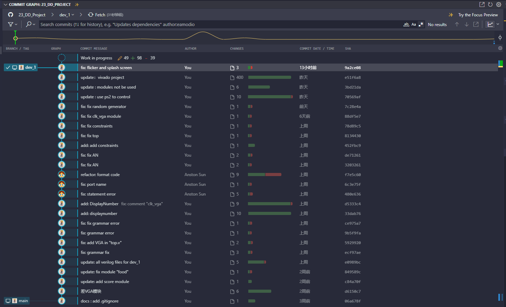

在实验过程中，我们遇到了许多未知与困难，包括按钮输入与预期不符、键盘输入非常陌生、硬件程序调试困难等，最终通过查资料、探讨、试错等方式得到了解决。Vivado日志文件可以看到我们总共在Vivado中完成了138次生成比特流。

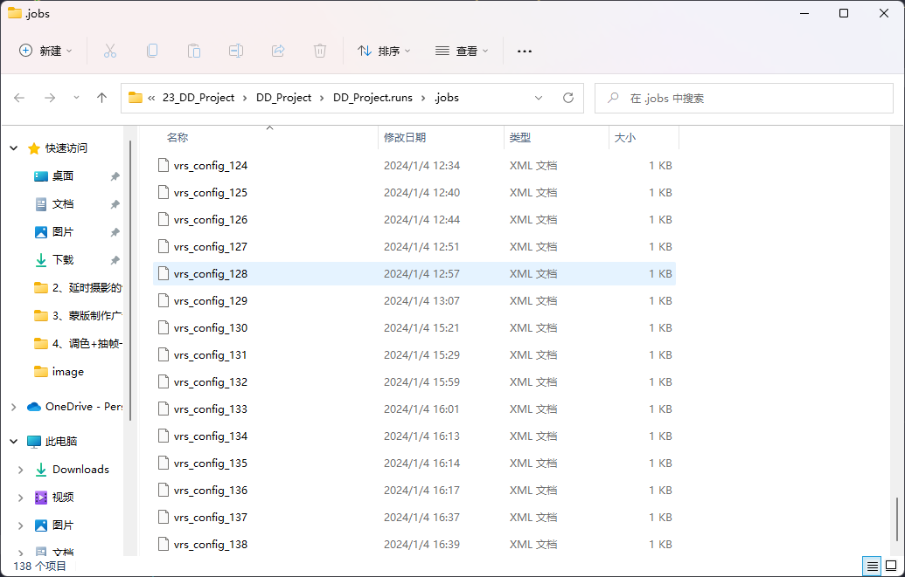

最终我们顺利解决了问题并成功地编写了贪吃蛇小游戏。手写硬件驱动让我们对于硬件输入输出有了更深的了解。编写bin2bcd模块也帮助我们复习了理论课上学习到的编码和组合逻辑知识。这一次课程大作业使我们收获许多实用知识与实现游戏的成就感。
